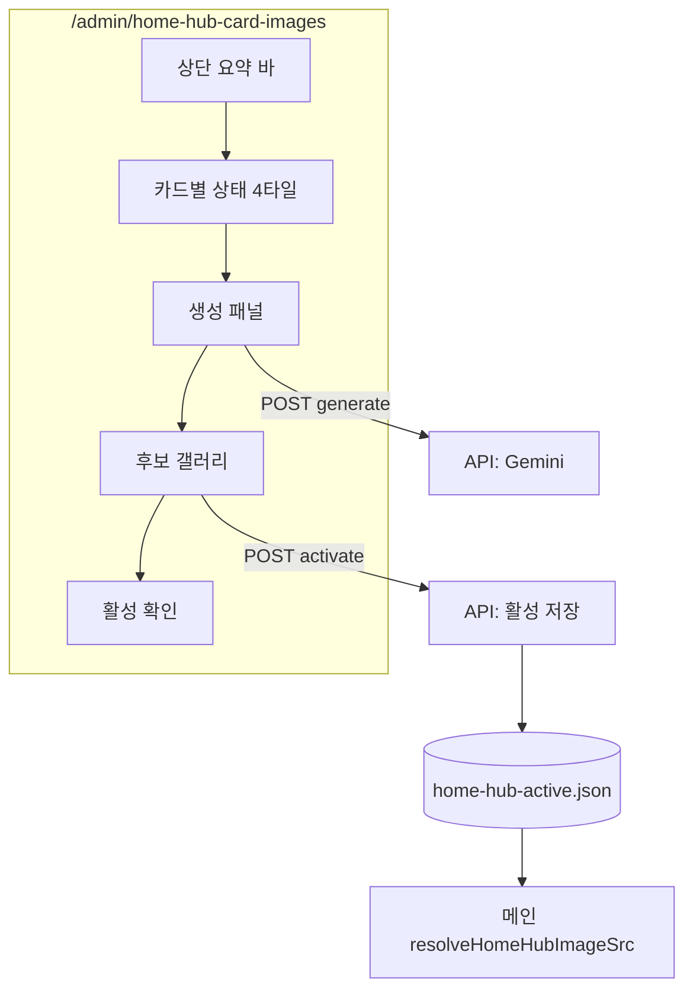

# 관리자: 메인 허브 카드 이미지 생성/선택 UI 설계

사용자 메인과 분리된 **관리자 전용** 관점. 구현 시 이 문서를 단일 기준(SSOT)으로 삼는다.

---

## 1. 페이지 목적 요약

메인 4허브 배경을 **사용자 페이지에서 생성하지 않고**, 관리자에서만 **제미나이 후보 생성 → 비교 → 1장 활성화**로 반영한다.

- ① 카드별 생성  
- ② 후보 비교  
- ③ 운영자 선택  
- ④ 활성 반영  

대상 키: `overseas` / `training` / `domestic` / `bus`.

현재는 `public/data/home-hub-active.json` + `resolveHomeHubImageSrc()`. 이후 DB(`home_hub_card_images`)로 이행해도 **동일 UX·API 경계**를 유지한다.

---

## 2. 화면 전체 구조

- **라우트:** `/admin/home-hub-card-images`  
- **제목(예):** 메인 허브 이미지 관리  

**5구역 (스크롤 A→E):**

| 구역 | 이름 | 역할 |
|------|------|------|
| A | 상단 요약 바 | 운영 시즌·4/4·마지막 반영 |
| B | 카드 상태 그리드 | 4타일: 썸네일·시즌·후보 수·활성·빠른 액션 |
| C | 생성 작업 패널 | 카드·시즌·프롬프트·개수·생성 버튼 |
| D | 후보 갤러리 | 필터 + 3~4열·선택·확대·삭제 |
| E | 활성 스냅샷 | 지금 메인에 나가는 것만 4행 요약 |



---

## 3. 데스크톱 와이어프레임

```
┌─────────────────────────────────────────────────────────────────────────────────┐
│ A  메인 허브 이미지 관리                                                          │
│    메인 4개 허브 배경을 제미나이로 생성·선택합니다. (페이지 로드 시 자동 생성 없음)   │
│    활성 시즌: [ summer ▼ ]     활성 카드: 4/4     마지막 반영: 2026-03-25 14:20   │
└─────────────────────────────────────────────────────────────────────────────────┘

┌─────────────────────────────────────────────────────────────────────────────────┐
│ B  카드 상태                                                                     │
│  ┌─────────────┐ ┌─────────────┐ ┌─────────────┐ ┌─────────────┐               │
│  │ 해외여행     │ │ 국외연수     │ │ 국내여행     │ │ 전세버스     │               │
│  │ ┌─────────┐ │ │ ┌─────────┐ │ │ ┌─────────┐ │ │ ┌─────────┐ │               │
│  │ │ 썸네일   │ │ │ │ 썸네일   │ │ │ │ (빈칸)  │ │ │ │ 썸네일   │ │               │
│  │ └─────────┘ │ │ └─────────┘ │ │ └─────────┘ │ │ └─────────┘ │               │
│  │ 시즌 summer │ │ 시즌 default│ │ 시즌 summer │ │ 시즌 default│               │
│  │ 후보 12     │ │ 후보 8      │ │ 후보 0 ⚠   │ │ 후보 4      │               │
│  │ ● 활성      │ │ ● 활성      │ │ ○ 미설정    │ │ ● 활성      │               │
│  │ 생성 14:02  │ │ 생성 09:30  │ │ —           │ │ 생성 11:00  │               │
│  │[생성][후보] │ │[생성][후보] │ │[생성][후보] │ │[생성][후보] │               │
│  └─────────────┘ └─────────────┘ └─────────────┘ └─────────────┘               │
└─────────────────────────────────────────────────────────────────────────────────┘

┌─────────────────────────────────────────────────────────────────────────────────┐
│ C  후보 생성                                                                     │
│  카드 [ 해외여행 ▼ ]    시즌 [ summer ▼ ]                                       │
│  개수  ( )2  (•)4  ( )6 장                                                       │
│  [ 기본 프롬프트 불러오기 ]  [ 초기화 ]                                           │
│  ┌───────────────────────────────────────────────────────────────────────────┐ │
│  │ 프롬프트 (textarea)                                                         │ │
│  └───────────────────────────────────────────────────────────────────────────┘ │
│  ℹ 톤 가이드(읽기 전용)                                                          │
│  [ 후보 생성하기 ]     (진행 중: 스피너 + disabled)                               │
└─────────────────────────────────────────────────────────────────────────────────┘

┌─────────────────────────────────────────────────────────────────────────────────┐
│ D  후보 갤러리                                                                   │
│  필터  카드 [ 전체 ▼ ]   시즌 [ 전체 ▼ ]   [ 새로고침 ]                           │
│  ┌────────┐ ┌────────┐ ┌────────┐ ┌────────┐                                    │
│  │ [img]  │ │ [img]  │ │ [img]  │ │ [img]  │                                    │
│  │ 후보/활성 배지 · 선택 · 미리보기 · 삭제                                         │
│  └────────┘ └────────┘ └────────┘ └────────┘                                    │
│  빈 상태: “이 카드·시즌에 후보가 없습니다. 위 패널에서 생성하세요.”                 │
└─────────────────────────────────────────────────────────────────────────────────┘

┌─────────────────────────────────────────────────────────────────────────────────┐
│ E  메인 반영 스냅샷                                                               │
│  카드 │ 썸네일 │ 시즌 │ 경로 │ 활성화 시각 │ 변경자                                │
└─────────────────────────────────────────────────────────────────────────────────┘
```

---

## 4. 모바일/태블릿 축소 방식

- **A:** 한 열, 시즌·4/4·시각 2줄 스택.  
- **B:** 모바일 1열, 태블릿 2×2.  
- **C:** 폼 세로 풀폭; 개수는 세그먼트 또는 드롭다운.  
- **D:** 1~2열; 필터는 가로 스크롤 칩.  
- **E:** 표 대신 아코디언 카드 4개.  
- 하단 고정 스티키 없음.

---

## 5. 관리자 작업 흐름

1. **A**에서 전역 시즌·반영 시각 확인.  
2. **B**에서 약한 카드 파악 → 「생성」으로 **C** 동기화·스크롤.  
3. **C**에서 프롬프트 검토 → **후보 생성하기** (단일 API, 중복 클릭 차단).  
4. 성공 시 **D**로 포커스/토스트.  
5. **D**에서 확대·**선택** → 확인 모달 → **활성 저장**.  
6. **E**로 최종 검수.

**원칙:** 생성 ≠ 적용.

---

## 6. 생성 패널 설계

- 상태: idle / generating / success / error.  
- 기본 프롬프트: `lib/home-hub-gemini-prompts.ts` (카드·시즌).  
- 불러오기 / 초기화 버튼.  
- 완료 시 갤러리 리프레시.

---

## 7. 후보 갤러리 설계

- 필터: `card_key`, `season` (AND).  
- 활성: ring + 배지.  
- `POST /activate`: 동일 `(card_key, season)`의 기존 활성 해제 후 1건 활성 + JSON 동기화.  
- 빈 상태 안내 문구.

---

## 8. 활성 이미지 관리 방식

- `(card_key, season)`당 활성 1장.  
- 메인: `activeSeason` + `images` — 상세 필드는 `docs/HOME-HUB-CARD-IMAGES.md` 및 `lib/home-hub-resolve-images.ts` 참고.

---

## 9. 시즌 운영 방식

- 키: `default` | `spring` | `summer` | `autumn` | `winter`.  
- 글로벌 `activeSeason`은 JSON `activeSeason` 필드로 관리 (레거시 `season` 키는 코드에서 폴백).

---

## 10. 데이터 구조 초안

DB 테이블·JSON 후보 파일 스키마는 **`docs/HOME-HUB-CARD-IMAGES.md`** 와 동일 계열로 유지.

---

## 11. 구현 우선순위

1. `home-hub-active.json` 스키마 (`activeSeason`, `lastUpdatedAt`, `images`) + resolve 확장  
2. 후보 저장소 (JSON 배열 또는 Prisma)  
3. API: generate / candidates / activate / summary  
4. UI: `HomeHubImageAdminClient` + A~E 컴포넌트  
5. `lib/home-hub-gemini-prompts.ts`  
6. `requireAdmin`, 레이트 리밋, 로깅  

---

## 12. 파일/컴포넌트 초안

| 경로 | 역할 |
|------|------|
| `app/admin/home-hub-card-images/page.tsx` | 레이아웃·데이터 |
| `HomeHubImageAdminClient.tsx` | C+D 상태 |
| `components/HubSummaryBar.tsx` | A |
| `components/HubCardStatusGrid.tsx` | B |
| `components/HubGeneratePanel.tsx` | C |
| `components/HubCandidateGallery.tsx` | D |
| `components/HubActiveSnapshot.tsx` | E |
| `app/api/admin/home-hub-images/*/route.ts` | generate, candidates, activate, summary |
| `lib/home-hub-gemini-prompts.ts` | 기본 프롬프트 |

---

*본 문서는 제품/디자인 합의용 스펙이다. 구현 세부는 PR 단위로 `HOME-HUB-CARD-IMAGES.md`와 동기화한다.*
