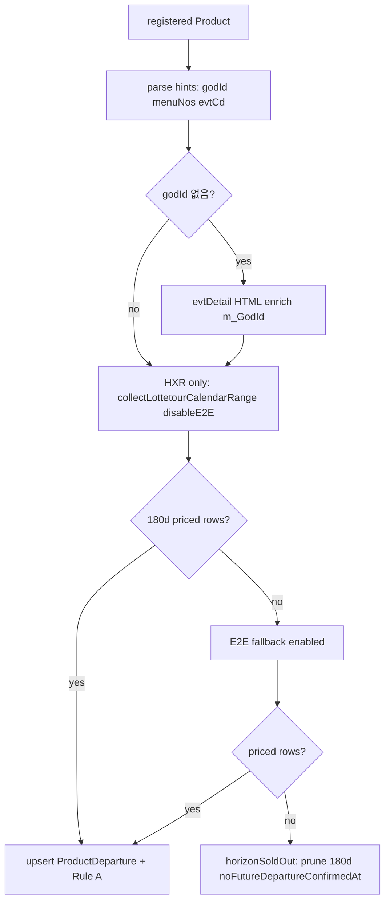

# 롯데관광(lottetour) 180일 horizon sweep 설계

## 배경

- 등록 상품 0건 — ybtour처럼 oneshot 검증을 기다리지 않고 설계·기반 코드부터 진행한다.
- 출발·가격 수집 SSOT는 이미 `lib/lottetour-departures.ts` (`evtListAjax` 공개 GET, HTML 테이블)이다.
- HXR 실측: `ops/lottetour-evtListAjax-probe.json` — 샘플 5 URL 모두 200·evtCd 행 확인 (Playwright 불필요).

## ybtour 대비 차이

| 항목 | ybtour | lottetour |
|------|--------|-----------|
| 1차 수집 | papi JSON `by-goods/{goodsCd}/{dspSid}/{YYYYMM}` | `GET /evtlist/evtListAjax?depDt=&godId=&menuNo1~4` HTML |
| 식별키 | goodsCd + dspSid (+ seed evCd) | godId + menuNo1~4 (+ evtCd 힌트) |
| evtList vs evtDetail | URL goodsCd 정규화 | evtList `?godId=` vs evtDetail `m_GodId`(상세 HTML) — **menu 경로가 다를 수 있음** |
| 2차 폴백 | Playwright E2E | Python subprocess (`LOTTETOUR_E2E_FALLBACK`, requests·동일 evtListAjax) |
| 등록 본문 | 붙여넣기 SSOT | 붙여넣기 SSOT (변경 없음) |

## 수집 흐름



## 모듈 (신규)

| 파일 | 역할 |
|------|------|
| `lib/lottetour-price-collect.ts` | HXR 우선 → E2E 폴백, 180일 창 필터 |
| `lib/lottetour-price-recheck-meta.ts` | rawMeta 7일 재확인 일정 |
| `lib/lottetour-sweep.ts` | 일1회 sweep (Rule A, urgent deal, prune) |
| `lib/instrumentation-lottetour-sweep-cron.ts` | KST 07:00 cron |
| `scripts/run-lottetour-horizon-hxr-coverage.ts` | DB 없이 probe URL 5건 live HXR 검증 |
| `scripts/run-lottetour-horizon-sweep-oneshot.ts` | 등록 후 전체 1회 sweep |

## 등록 시 rawMeta / originUrl 계약

- `parseLottetourEvtListCollectionHints(rawMeta, originUrl)` — godId, categoryMenuNo, evtCd.
- evtList URL: `?godId=` 쿼리에서 godId.
- evtDetail URL만 있을 때: menuNos는 path, godId는 상세 HTML `m_GodId` enrich.
- **주의**: evtDetail path menu ≠ evtList path menu (예: phuquoc 857/1063 vs evtList 856/1034) — 등록 시 **수집에 쓸 menuNos·godId를 rawMeta에 명시**하거나 evtList URL을 originUrl로 둔다.

## 환경 변수 (롯데 전용)

- `LOTTETOUR_E2E_FALLBACK` — `0`이면 sweep에서 E2E 생략 (기본 `1`).
- `LOTTETOUR_CALENDAR_MONTH_COUNT` — 레거시 12; sweep은 180일 창에서 월 수 자동 산출.
- `LOTTETOUR_ONESHOT_PAUSE_MS` — oneshot 상품 간 대기 (기본 2500).
- `LOTTETOUR_HXR_COVERAGE_PAUSE_MS` — coverage probe 간 대기 (기본 800).
- `DISABLE_INSTRUMENTATION_LOTTETOUR_SWEEP_CRON=1` — cron 비활성.

## 검증 (등록 전)

```bash
npm run db:lottetour-hxr-coverage
# → ops/lottetour-horizon-hxr-coverage.json
```

## 등록 후 운영

```bash
npm run db:lottetour-sweep-oneshot
npm run db:lottetour-sweep-oneshot -- --dry-run
```

일1회 cron: `sweepDueLottetourProducts` (KST 07:00, ybtour 06:00와 분리).

## 일정 API (가격 sweep과 별도 — 2026-06-19 probe)

| 엔드포인트 | plain GET | 비고 |
|-----------|-----------|------|
| `evtListAjax` | ✅ 가격·출발 | sweep SSOT (`lib/lottetour-departures.ts`) |
| `evtDetailScheduleAjax?evtCd=&viewType=basic` | ✅ HTML 200 | 일정·미팅 SSOT (`godId`/`godScheId` 불필요) |
| `evtSpotListAjax?evtCd=&godScheId=&viewType=basic` | ✅ HTML 200 | 선택관광 목록 — `godScheId`는 basicAjax `callEvtDetailScheBasDetlLisAjax`에서 추출 |
| `evtDetailScheBasDetlLisAjax` | ⚠️ `godScheId` 필수 | 약관 HTML — 일정 본문 아님 |
| `evtScheEtcList` | ⚠️ JSON 200 | `scheList` 메타만(행사별 godScheId 미매칭) |
| `evtDetailBasicAjax` | ✅ HTML | 행사·포함/불포함·godScheId 힌트 |
| evtDetail SSR | — | 일차 텍스트 0 — scheduleAjax lazy-load |

**등록 상세카드:** `lib/lottetour-register-api-detail.ts` + `lib/lottetour-register-detail-collect.ts` — basicAjax·coreInfo·scheduleAjax·spotListAjax augment.

Probe artifacts: `ops/lottetour-schedule-api-probe.json`, `ops/lottetour-schedule-endpoint-live.json`, `ops/lottetour-schedule-godScheId-probe.json`

## 회귀 얼림

- `lottetour-hxr-departure-collect` — price-collect HXR→E2E·horizonSoldOut
- `lottetour-sweep-e2e-recheck` — sweep·7일 재확인·stale 정리
