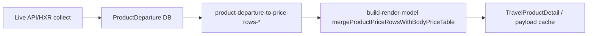

# 공급사 API 수집 → 공개 상품상세 정합 계약

## 목적

180일 horizon **API/HXR sweep**으로 적재한 `ProductDeparture`가 공개 상품상세(`/products/[slug]`) 달력·요금·출발 key facts에 **왜곡 없이** 반영되는지 검증한다.

## 완료 공급사 (sweep/API 1차 경로)

| 공급사 | 수집 SSOT | sweep 모듈 | price-row 변환 |
|--------|-----------|------------|----------------|
| modetour | B2C `GetOtherDepartureDates` (+ SD1 단일출발) | `lib/modetour-sweep.ts` | `lib/product-departure-to-price-rows-modetour.ts` |
| hanatour | gw.hanatour.com 월 API | `lib/hanatour-sweep.ts` | `lib/product-departure-to-price-rows-hanatour.ts` |
| ybtour | papi `by-goods` 월 API (+ evCd `/price`) | `lib/ybtour-sweep.ts` | `lib/product-departure-to-price-rows-ybtour.ts` |
| verygoodtour | ProductCalendarSearch HXR (+ E2E 폴백) | `lib/verygoodtour-sweep.ts` | `lib/product-departure-to-price-rows-verygoodtour.ts` |

**미완/별도:** lottetour (sweep·cron 완료, parity 미포함), kyowontour.

## 데이터 흐름 (3계층)



### L1 — Live API vs DB

- 대상: 등록 상품, KST 오늘 ~ +180일
- 키: `(departureDate YMD, adultPrice)` — 공급사별 `supplierPriceKey`는 부가 비교
- 허용: 동일 날짜 다중 evtCd/팀 → upsert 정책상 **마지막 행**만 DB에 남음 (ybtour/lottetour)

### L2 — DB vs price-row 변환

- `productDeparturesToProductPriceRows(departures)` 성인가·상태·잔여석이 DB와 1:1
- **본문 표 merge 전** 순수 departure 변환만 비교 (merge는 등록 본문 SSOT)

### L3 — price-row vs 공개 payload

- `buildProductPublicDetailRenderModel` → `priceRowsForPublic` / `viewProduct.prices`
- 캐시 hit 시 `publicDetailPayloadJson` 역직렬화 비교
- 항공 key facts: `departureKeyFactsByDate` ← `ProductDeparture` carrier·flight 필드

## 공급사별 merge 주의 (L2→L3)

| 공급사 | 본문 표 merge | 비고 |
|--------|---------------|------|
| modetour | `modetourVaryingAdultChildLinkage` | 출발별 성인가 다르면 아동 연동 규칙 |
| ybtour | `ybtourVaryingAdultChildLinkage` | 유아는 행 값 유지 |
| hanatour | 기본 merge | 아동·유아 슬롯 |
| verygoodtour | 패키지=출발행 SSOT, airtel=본문 표 SSOT | sweep 전 별도 |

## 검증 실행

```bash
# 전체 (DB 필요)
npm run verify:supplier-api-public-detail-parity

# 공급사·샘플 제한
npm run verify:supplier-api-public-detail-parity -- --supplier ybtour --limit 5
npm run verify:supplier-api-public-detail-parity -- --slug pkg-yb-0001

# L1 생략 (DB↔상세만, 오프라인)
npm run verify:supplier-api-public-detail-parity -- --skip-live-api
```

결과: `ops/supplier-api-public-detail-parity.json`

## L3 한계 (현재)

- `buildProductDetailPageInclude` — `departures.take = 100` (`DETAIL_DEPARTURE_PER_PRODUCT_TAKE`)
- sweep은 180일 전구간 upsert → **101번째 이후 출발은 상세 달력에 미노출** 가능
- parity L3는 **상세에 실제 로드된 departures** 기준으로만 비교
- trunc=true 항목은 운영 이슈( take 상향 또는 월별 on-demand ) 별도 추적

- **L1** `api_db_mismatch` = 0 (또는 sweep 직후 24h 내 재수집 예정 명시)
- **L2** `departure_row_mismatch` = 0
- **L3** `public_row_mismatch` = 0 (본문 merge 후에도 성인가·날짜 집합은 departure SSOT와 일치)

샘플: 공급사별 등록 ≥1이면 최소 3 slug, 없으면 API coverage probe URL로 L1만.

## verygoodtour (다음)

- HXR: `ProductCalendarSearch` HTML — **모달·JS 없이는 가격 행 0** (probe 확인)
- 1차: `ProductCalendarSearch` + 우측 행 파서 (E2E와 동일 DOM SSOT)
- 2차: stale URL guard (`verygoodtour-detail-url-health`) + sweep
- DB 17건 전부 stale 404 — **재등록 후** parity 포함

설계: `docs/ops/verygoodtour-horizon-sweep-design.md`
